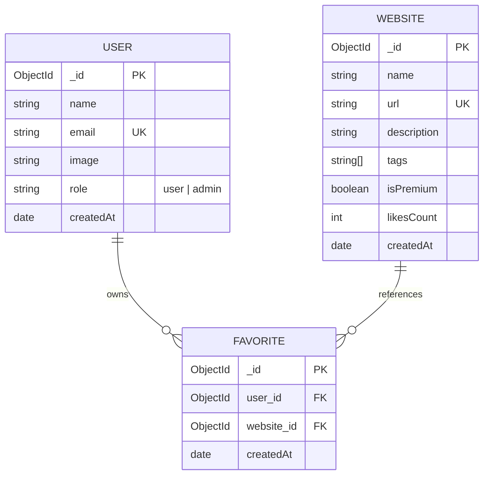

# [Web Hunter](https://webhunter.space)

A curated web directory with AI-assisted bulk curation via Groq + Google Sheets, fuzzy search, and a React Query-powered favorites system.

---

## Screenshots

- Discover Page:


- Admin Page:


---

## Table of Contents

- [Features](#features)
- [Tech Stack](#tech-stack)
- [Architecture & Database Models](#architecture--database-models)
- [Environment Configuration](#environment-configuration)
- [Local Development](#local-development)
- [Directory Structure](#directory-structure)
- [Key Technical Decisions](#key-technical-decisions)

---

## Features

### 🌟 For Explorers (Users)

- **Niche Curations**: Browse a curated selection of resources organized across 90+ categories (e.g., _AI Agents, AI Art, Web Dev, 3D Modeling, Productivity, etc._).
- **Dynamic Search**: Keyboard-shortcut-enabled (`/` key) fuzzy search overlay that checks names, descriptions, and tags.
- **Likes & Favorites System**: Save resources to a personalized dashboard. Caching is handled dynamically via React Query for instant UI updates.
- **Interactive UI**: Fluid animations (using Framer Motion), marquee banners showcasing trending items, dark/light mode toggling, and clean responsive layouts.

### 🛡️ For Curators (Admins)

- **Manual Insertion**: Add, preview, and label individual resources directly through a visual submission form.
- **AI-Powered Bulk Sync**: Connect a Google Spreadsheet to fetch hundreds of tool submissions at once.
- **Automated Categorization**: Leverage LLMs via the **Groq API** to process spreadsheet rows, auto-clean titles, generate concise descriptions, and assign appropriate categories.
- **Interactive Curation Table**: Review, delete, and modify AI-generated labels in real time before executing a bulk database insert.
- **Full CRUD Management**: Seamlessly update or delete existing listings via modal overlays directly on the Discover page.

---

## Tech Stack

- **Framework**: [Next.js 15](https://nextjs.org/) (App Router, Server Actions, Route Handlers)
- **Frontend library**: [React 19](https://react.dev/)
- **State Management**: [Zustand](https://github.com/pmndrs/zustand) (stores for auth session and websites)
- **Client Cache / Queries**: [TanStack React Query v5](https://tanstack.com/query/latest) (handling real-time favorited states)
- **Styling**: Tailwind CSS & Vanilla CSS Variables
- **Database**: [MongoDB](https://www.mongodb.com/) via [Mongoose ODM](https://mongoosejs.com/)
- **Authentication**: [NextAuth.js](https://next-auth.js.org/) (Google OAuth 2.0 & Microsoft Azure AD provider)
- **AI Engine**: [Groq SDK](https://github.com/groq/groq-sdk) (specifically leveraging `openai/gpt-oss-120b` or `llama-3.1-8b-instant` models)
- **External API**: [Google Sheets API v4](https://developers.google.com/sheets/api)

---

## Architecture & Database Models

The database schema is structured into three primary collections:



### 1. User Model (`models/User.ts`)

Tracks signed-in users. Roles are designated as `"user"` (default) or `"admin"`. Registration is handled automatically upon the user's first successful OAuth sign-in.

### 2. Website Model (`models/Website.ts`)

Stores indexable details. A text index is created on `name`, `description`, and `tags` to support quick fuzzy matching. A custom mongoose setter automatically strips common title suffixes (e.g., `|`, `•`, `-`) from names to maintain a clean display.

### 3. Favorite Model (`models/Favorite.ts`)

A junction model that pairs users with their liked websites. It uses a compound unique index ` { user_id: 1, website_id: 1 }` to prevent duplicate likes and keep data consistent.

---

## Environment Configuration

Create a `.env` (or `.env.local`) file in the root directory. You can use `.env.example` as a template. Do **not** commit your credentials:

```bash
# Database
MONGODB_URI=your-mongodb-connection-string

# NextAuth Configuration
NEXTAUTH_SECRET=your-nextauth-secret-key

# OAuth Providers
GOOGLE_CLIENT_ID=your-google-oauth-client-id
GOOGLE_CLIENT_SECRET=your-google-oauth-client-secret
AZURE_AD_CLIENT_ID=your-microsoft-azure-client-id
AZURE_AD_CLIENT_SECRET=your-microsoft-azure-client-secret
AZURE_AD_TENANT_ID=your-microsoft-tenant-id

# Bulk Data Curation
GOOGLE_SHEET_ID=your-default-google-sheet-id
GOOGLE_PRIVATE_KEY=your-google-api-key
GROQ_API_KEY=your-groq-cloud-api-key
```

---

## Local Development

### Prerequisites

- Node.js (v18.x or later recommended)
- MongoDB Instance (Atlas or Local)

### 1. Clone & Install

```bash
git clone <repository-url>
cd WH-ai
npm install
```

### 2. Configure Environment

Copy `.env.example` to `.env` and fill in the required keys.

### 3. Run Development Server

```bash
npm run dev
```

Open [http://localhost:3000](http://localhost:3000) in your browser to view the application.

---

## Directory Structure

```text
├── app/                  # Next.js App Router Pages & API handlers
│   ├── api/              # API Route Handlers (auth, admin, websites, favorites)
│   ├── admin/            # Admin Dashboard view page
│   ├── auth/             # Login screen (Google & Microsoft)
│   ├── my-favorites/     # User Favorites list dashboard
│   ├── layout.tsx        # Global Layout config with providers
│   └── page.tsx          # Main Landing/Discover entry page
├── components/           # UI Components
│   ├── feedback/         # Custom toast / notifications
│   ├── layout/           # Shared page layout elements (Header, Footer, Landing)
│   ├── providers/        # Query and Session wrappers
│   └── ui/               # Base design components (buttons, badges, cards)
├── features/             # Feature-specific components
│   ├── admin/            # Manual and AI Bulk importer sheets
│   ├── discover/         # Discover feed grids, cards, modals, pagination
│   └── search/           # Global fuzzy search window
├── hooks/                # Custom React Hooks (e.g., query params handling)
├── lib/                  # Backend configurations, utils & database connections
│   ├── admin/            # AI bulk categorization and Sheet fetch algorithms
│   ├── cache/            # API call cached handlers (favorites toggling)
│   └── db.ts             # Mongoose connection initiator
├── models/               # MongoDB Mongoose models
├── store/                # Zustand Client state management stores
└── types/                # TypeScript interfaces
```

---

## Key Technical Decisions

### 1. State Co-existence: React Query alongside Zustand

We leverage **Zustand** for simple client-side global stores containing relatively static or session-based state (such as user authentication metadata and full website listings). For highly dynamic server-state operations—specifically the user's liked/favorited listings—we use **TanStack React Query**. React Query allows us to manage cached favorites, perform automatic query invalidations, and implement immediate client-side optimistic UI updates (giving instant feedback on heart clicks) without writing complex manual reducers or polluting global store logic.

### 2. Database Integrity: Compound Unique Indexes

Instead of relying solely on application-level validations to check for duplicate favorites, the `Favorite` schema utilizes a database-level compound unique index on `{ user_id: 1, website_id: 1 }`. This guarantees strict database integrity, ensuring a user cannot upvote a website multiple times due to race conditions or rapid double-clicks. It also indexes the pair together, significantly accelerating queries that check whether the current user has favorited a given tool card during render loops.

### 3. Vendor Selection: Groq API over Direct OpenAI API

For our spreadsheet categorization bulk syncing, the dashboard uses the **Groq SDK** targeting high-performance open-source models (such as Llama-3). Groq's specialized hardware allows near-instantaneous JSON chat completions with latency parameters far below OpenAI. This ensures the admin's experience of processing large batches of links feels direct and real-time, eliminating the need for long-running spinners.

### 4. End-to-End AI Bulk Curation Pipeline

The automated import workflow operates in five stages:

1. **Spreadsheet Ingestion**: The admin provides a Google Spreadsheet ID and Range. The API fetches raw data using a public Sheets API v4 URL.
2. **Sanitization**: Row objects are validated, ignoring empty columns or entries with error markers (e.g. `#REF!`, `#N/A`).
3. **AI Prompt Engineering**: Valid items are chunked and packaged into prompts sent to Groq. The prompt restricts tag generation to a predefined list of allowed categories, requests description sanitization, and cleans names of common SEO title garbage (like `| Home` or `- Free Tool`).
4. **Structured JSON Output**: The LLM output is parsed into a clean JSON array representing cleaned names, descriptions, and tags.
5. **Ordered Insertions**: Curators preview the generated results, manually removing or editing listings before executing a bulk database insert. The insert is performed using MongoDB's `insertMany` configuration with `{ ordered: false }`, ensuring that duplicate URL validation failures block duplicate listings without halting the ingestion of new unique ones.
